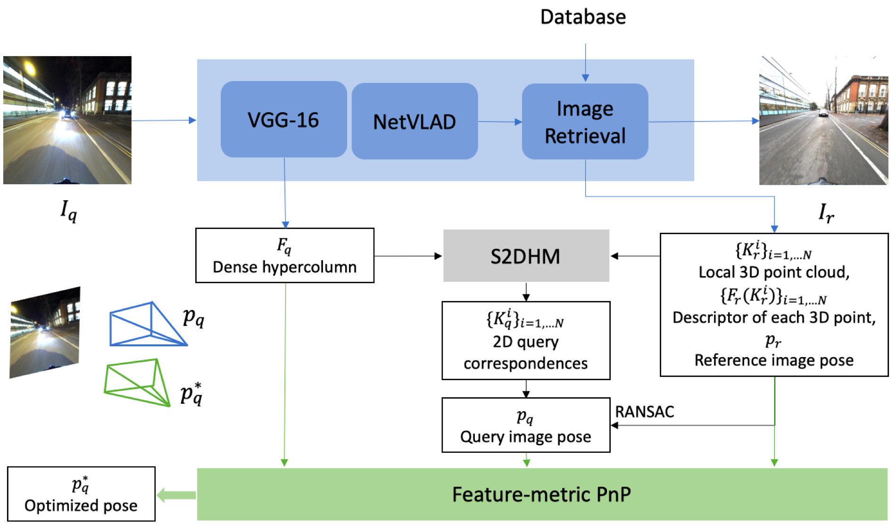

# S2DHM with Feature-PnP

This repository is based on the official S2DHM repository with integration of Feature-PnP module and customizable VGG-16 features (e.g. trained using [gn_net](https://github.com/zimengjiang/gn_net)).

<p align="center">
    
</p>

Based on S2DHM,the RANSAC-PnP pose is further fed into our Feature-metric PnPmodule, together with 2D-2D correspondences between query andreference image, 2D-3D correspondences between reference image and 3D wolrd points, sparse reference hypercolumn of each 3D point, and the dense hypercolumns of query image. The output is the op-timized pose.  Different from S2DHM, where hypercolumns areextracted from the VGG-16 backbone specifically trained for im-age retrieval, we fine-tune VGG-16 used in S2DHM with super-vision on cross-season correspondences and extract hypercolumnsfrom it.


## Code contribution
This is a fork of the orginal S2DHM repo where most code are kept intact. My implementation of Feature-PnP is located in `s2dhm/featurePnP`, which builds on the Deep3DV codebase of Paul-Edouard Sarlin. My implementation of local validation is located in `s2dhm/test_featurePnP` where you can find code for evaulating Feature-PnP on toy examples(interface deprecated, but you can see how toy examples are created), as well as the real-life images in the RobotCar/CMU dataset. 

## Environment Setup
```bash
git clone https://github.com/zimengjiang/S2DHM.git
cd S2DHM
git checkout vgg
conda env create -f environment.yml 

# properly setup data following the directory structure of the as below.
${S2DHM}
├── data
├── ├── cmu_extended/
|       ├── slice*/
|       ├── ... 
|   ├── robotcar
│       ├── databases/
│       ├── images/
│       ├── ...
│   ├── triangulation/
│       ├── *.npy
```
